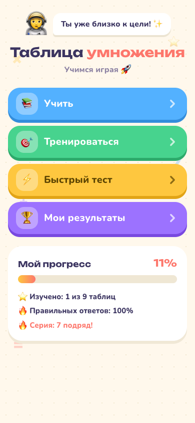
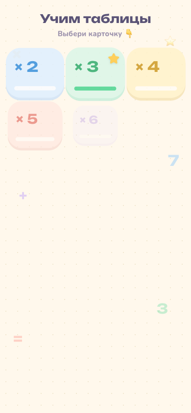
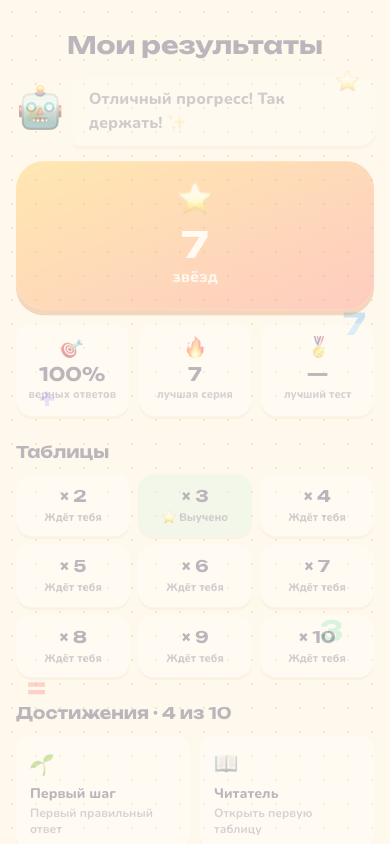

# 🚀 Таблица умножения — Учимся играя

Весёлое приложение, которое помогает детям выучить таблицу умножения играючи.
Яркие экраны, дружелюбный маскот и маленькие награды превращают зубрёжку в игру. 🎉

## ✨ Что внутри

- 📚 **Учим** — наглядный разбор каждой таблицы, шаг за шагом
- 🏋️ **Тренируем** — практика примеров с подсказками и подбадриванием
- 🎯 **Проверяем** — мини-тесты с мгновенными результатами
- 🏆 **Достижения** — значки за старание и прогресс
- 📱 **PWA** — добавь на главный экран и учи без интернета

## 🌐 Живой пример

Готовая версия уже живёт здесь: **https://urtaevs.github.io/mult-table-kids/**

## � Скриншоты (мобильный вид)

<div align="center">
  
  
  
  
</div>

<p align="center"><sub>Главная · Учить · Тренировка · Результаты</sub></p>

## �🚀 Быстрый старт

```bash
npm install
npm run dev
```

Открой **http://localhost:5173** — и вперёд! 💛

Сборка для продакшена:

```bash
npm run build      # собирает в папку dist/
npm run preview    # предпросмотр собранной версии
```

## 🤖 Android (APK)

Готовый `.apk` для установки на телефон — в **Releases**:
👉 https://github.com/urtaevS/mult-table-kids/releases/latest


## 🛠 Технологии

React · TypeScript · Vite · Tailwind CSS · vite-plugin-pwa · Capacitor

---

Сделано с заботой, чтобы учёба была радостью. 🌟
