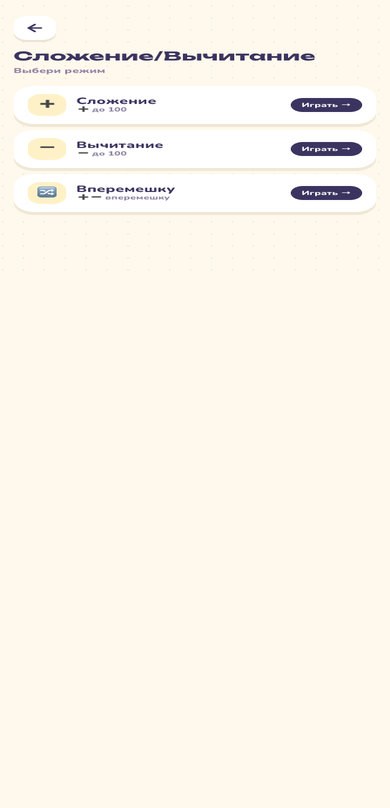
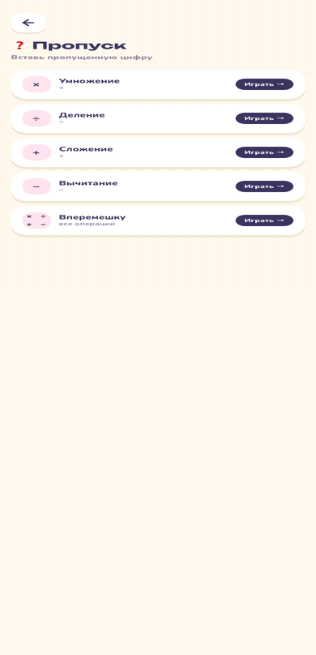
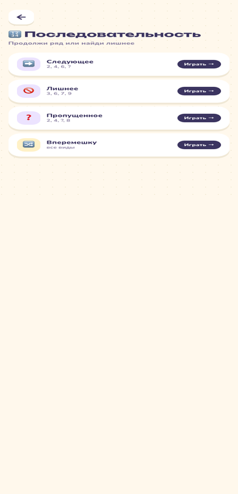

# 🚀 Учимся — играя

Весёлое приложение, которое помогает детям учить математику играючи.
Умножение, счёт до 100, пропущенные цифры и ряды — яркие экраны, дружелюбный маскот и награды превращают зубрёжку в игру. 🎉

## ✨ Что внутри

- 📚 **Учим таблицы** — наглядный разбор ×2–×10 шаг за шагом
- 🎯 **Тренируем / На время** — практика умножения + таймер ⏱️ с тиком
- 🧮 **Сложение/вычитание до 100** — ➕➖ вперемешку
- ❓ **Пропущенная цифра** — вставь `× ÷ + −`
- 🔢 **Ряд чисел** — продолжи `2,4,6,?` или найди лишнее
- ⚡ **Быстрый тест** — микс из всех тем (10 вопросов)
- 🏆 **Достижения + рекорды** — значки и прогресс по всем играм
- 🔊 **Звуки** — озвучка ответов/достижений и тихий фон (🔊/🔇 в Результатах)
- 📱 **PWA** — добавь на главный экран и учи без интернета

## 🌐 Живой пример

Готовая версия уже живёт здесь:

[](https://urtaevs.github.io/mult-table-kids/)

## 🖼️ Скриншоты (мобильный вид)

<div align="center">
  
  
  
  
</div>
<p align="center"><sub>Главная · Учить · Тренировка · Результаты</sub></p>
<div align="center">
  
  
  
</div>
<p align="center"><sub>➕ Сложение/вычитание · ❓ Пропущенная цифра · 🔢 Ряд чисел</sub></p>

## 🚀 Быстрый старт

```bash
npm install
npm run dev
```

Открой **http://localhost:5173** — и вперёд! 💛

Сборка для продакшена:

```bash
npm run build      # собирает в папку dist/
npm run preview    # предпросмотр собранной версии
```

## 🤖 Android (APK)

Готовый `.apk` для установки на телефон скачивай в **Releases**:

[](https://github.com/urtaevS/mult-table-kids/releases/latest)

Скачай файл и разреши установку из неизвестных источников на телефоне. 🤖


## 🛠 Технологии

React · TypeScript · Vite · Tailwind CSS · vite-plugin-pwa · Capacitor · Preferences (сохранение прогресса) · Web Audio (звуки)

---

Сделано с заботой, чтобы учёба была радостью. 🌟
